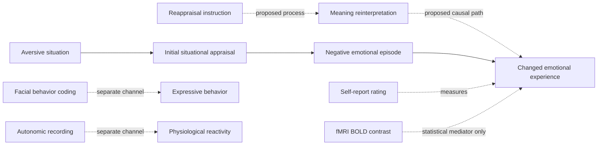

# Cognitive reappraisal pilot: provisional visual preview

This Mermaid diagram is a disposable projection of the YAML records, not the
final PMM visualization architecture.

## Scientific status

| Element | PMM status | Reason |
|---|---|---|
| Reappraisal instruction | Experimental intervention | Randomly assigned or counterbalanced |
| Lower reported negative emotion | Supported causal effect | Converges across several laboratory experiments |
| Lower autonomic reactivity | Mixed | Effects differ across studies and physiological channels |
| Meaning reinterpretation | Proposed mechanism | Usually instructed but not independently verified or manipulated |
| Reappraisal-related BOLD response | Measurement | Neural association is not a mechanism by itself |
| Neural mediation | Statistical mediation | Does not establish causal mediation without stronger assumptions |
