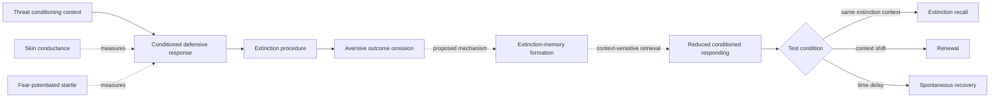

# Fear extinction pilot: provisional visual preview

This is a disposable projection of the YAML records, not the PMM visual-map architecture.
GitHub renders the Mermaid diagram below directly in the document.

## How to read it

- Solid arrows summarize experimental sequence or test arrangement.
- Dotted arrows mark theoretical interpretation, not directly observed entities.
- `Renewal` and `spontaneous recovery` are response patterns under specified tests, not mechanisms.
- Measurements are kept separate because skin conductance, startle, expectancy, and self-report can diverge.

## Scientific status

| Element | PMM status | Reason |
|---|---|---|
| Within-session response reduction | Empirically observed | Measured during repeated unreinforced cue presentations |
| Context-dependent renewal | Empirically supported | Controlled context changes can restore conditioned responding |
| Spontaneous recovery | Empirically supported but procedure-sensitive | Response recovery varies with timing and measurement |
| Extinction as new context-sensitive learning | Proposed integrative mechanism | Fits return-of-fear data but is not uniquely identified by them |
| Complete erasure after ordinary extinction | Not supported as a general model | Renewal and recovery demonstrate preserved response potential |
| Reactivation-extinction prevents return | Currently not robust | Registered direct replication did not show the claimed advantage |
