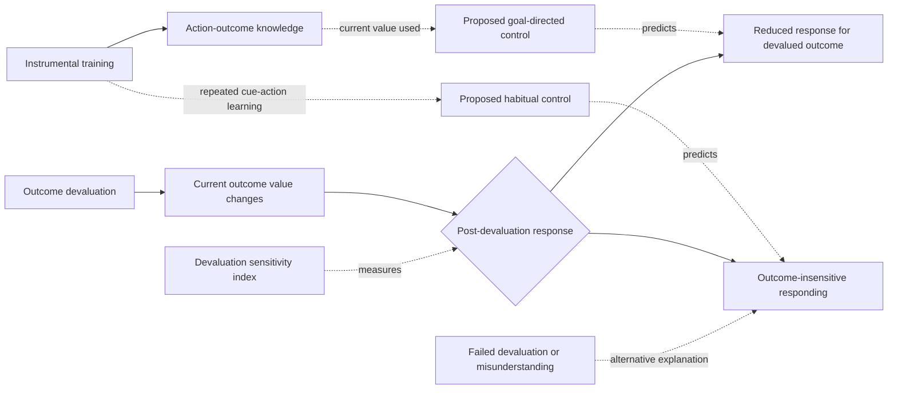

# Habit control pilot: provisional visual preview

This Mermaid diagram is a disposable projection of the YAML records, not the
final PMM visualization architecture.

## Scientific status

| Element | PMM status | Reason |
|---|---|---|
| Instrumental response | Directly observed behavior | Key press or choice in a programmed contingency |
| Current outcome value | Time-indexed motivational state | Must be checked after devaluation |
| Outcome-insensitive responding | Inferred response pattern | Requires valued-outcome comparison and manipulation checks |
| Habitual control | Proposed mechanism | Not directly observed and not uniquely identified by persistence |
| Goal-directed control | Proposed mechanism | Inferred from value- and contingency-sensitive responding |
| Overtraining causes habits | Mixed evidence | Original positive result was not supported in a larger multilaboratory study |
| Acute stress causes a habit shift | Not robust | Two preregistered exact replications did not support the effect |
| Habit tasks measure one common process | Unsupported | Six paradigms and self-report measures did not converge |
